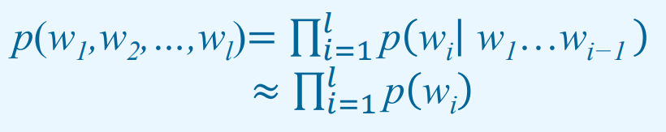
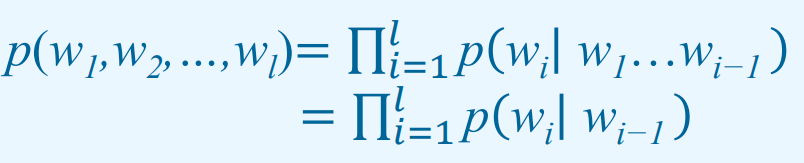
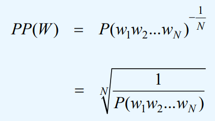

**姓名：刘权祥**

**学号：2019300414**

# 第二次作业

[TOC]

## 实验目的

- 根据训练集建立不同类别的一元和二元语法；
- 使用朴素贝叶斯分类模型进行测试集文本分类；
- 语言模型使用困惑度进行评估；
- 分类使用准确率，召回率，F1进行性能评估。

## 实验内容&原理

### 数据的初步处理

由于我们这次作业的数据是中文，不存在拉丁语系的天然分词结果，而朴素贝叶斯的文本分类是基于单词的，所以在开始建立语言模型或采用朴素贝叶斯分类之前，我们还需要对数据进行初步的处理，至少是将文本做分词处理。

根据所给数据的特点，我采用下面的方式来读取和处理数据:

1. **读取tsv文件为`[{'label' : '0' or '1', 'text' : 'XXX'}, ......]`格式的数据**

   读取文件之后将所有的空格都删除，由于label标签和text标签之间是制表符“\t”，所以并没有影响。

   之后将"\t"替换为空格并且按行分词，之后可以得到每一行的数据，同时label和text之间会留下一个空格。

   之后根据空格区分label和text，即可得到`[{'label' : '0' or '1', 'text' : 'XXX'}, ......]`格式的数据。

2. **使用jieba对text部分的内容进行分词处理，得到`[{'label' : '0' or '1', 'text' : 'XX X XXX xxx'}, ......]`格式的数据**

   使用jieba读取提供的词汇表`vocab.txt`，然后进行分词即可。（直接进行分词也可以，对最终的结果影响并不大。）

3. **在分词的结果中插入“\<BOS\>”和"\<EOS\>"**

   插入“\<BOS\>”和"\<EOS\>"，分别标志这文本的开头和结尾，方便后续的处理。

### 一元语言模型的建立

**一元语法模型（Unigram model）**：假设下一个词的出现依赖它前面的0个词。



根据一元语法模型的公式，我们得知建立一元语法模型的关键是获取每一个单词$w_i$出现的概率$P(w_i)$。因此我们可以通过以下的方式来建立模型：

- 输入`[{'label' : '0' or '1', 'text' : 'XX X XXX xxx'}, ......]`格式的数据集
- 读取数据集中的每一行文本，保存文本中出现的单词，并且统计每一个单词的词频
- 统计完成后，利用集合的特性得到非重复词
- 根据统计的结果即可计算每一个单词$w_i$出现的概率$P(w_i)$

**核心代码：**（这里的代码是针对单一label进行训练的，所以没有区分label的内容）

```python
    def train_good_model(self, train_data):
        """
        训练一元语法模型
        :param train_data:训练集
        """
        # 分别构建差评和好评的语言模型
        for line_data in train_data:
            for word in line_data["text"]:
                self.data_good.append(word)
                # 统计单词出现次数
                self.word_count_good.setdefault(word, 0)
                self.word_count_good[word] += 1
        # 统计非重复词
        self.unique_words_good = list(set(self.data_good))
```

### 二元语言模型的建立

**二元语法模型（Bigram model）**：假设下一个词的出现依赖它前面的一个词。



根据二元语法模型的公式，我们需要得知每一个$p(w_i|w_{i-1})$的值，我们可以理解为就是计算$w_{i-1}w_i$出现的概率，这样的话计算方法就和上面没有区别了。

但由于我们使用二元语法模型进行分类的时候，也需要计算单个单词出现的概率，所以我们构建模型的方法如下：

- 输入`[{'label' : '0' or '1', 'text' : 'XX X XXX xxx'}, ......]`格式的数据集
- 像建立一元语法模型一样，保存文本中出现的单词、统计词频、得到非重复词
- 将目前的单词$current\_word$，和它前面的单词$forward\_word$构成二元组$(current\_word, forward\_word)$
- 还是和构建一元模型一样，保存文本中出现的二元组、统计二元组的词频、得到非重复的二元组。

**核心代码：**（这里的代码是针对单一label进行训练的，所以没有区分label的内容）

```python
    def train_model(self, train_data):
        """
        训练一元语法模型
        :param train_data:训练集
        """
        for line_data in train_data:
            # 开头特殊处理一下
            self.data_.append("<BOS>")
            self.word_count_.setdefault("<BOS>", 0)
            self.word_count_["<BOS>"] += 1
            for i in range(len(line_data["text"]) - 1):
                current_word = line_data["text"][i + 1]
                forward_word = line_data["text"][i]
                # 记录单个单词
                self.data_.append(current_word)
                self.word_count_.setdefault(current_word, 0)
                self.word_count_[current_word] += 1
                # 记录两个单词在一起
                self.data_tuple_.append((current_word, forward_word))
                self.word_count_tuple_.setdefault((current_word, forward_word), 0)
                self.word_count_tuple_[(current_word, forward_word)] += 1
        # 统计非重复词
        self.unique_words_ = list(set(self.data_))
        self.unique_words_tuple_ = list(set(self.data_tuple_))
```

### 语言模型的困惑度

**困惑度（Perplexity）**：测试集概率的倒数



**对于一元语法：**

我们知道$P(w_1w_2...w_N)=P(w_1)P(w_2)......P(w_N)$，因此我们根据给出的句子，直接求每一个单词的概率的乘积再求它的$-\frac1N$次幂即可！

但由于这样做可能导致乘出来的结果非常小，可能导致下溢出，所以我们需要转换一下计算方式 ，采用对数的方法计算：
$$
PP(W)=P(w_1w_2...w_N)^{-\frac1N}\\
=exp(log(P(w_1w_2...w_N)^{-\frac1N}))\\
=exp(-\frac1N*(log(P(w_1))+log(P(w_2))+...+log(P(w_N))))
$$


**对于二元语法：**

与一元语法模型不同的地方在于：$P(w_1w_2...w_N)=P(w_1|<BOS>)P(w_2|w_1)......P(w_N|w_{N-1})P(<EOS>|w_N))$。其他部分基本一致！

**核心代码：**

```python
    def get_perp(self, sentence):
        """
        计算语言模型的困惑度
        :param sentence: 句子
        :return: 语言模型对于该句子的困惑度
        """
        perplexity = 0
        for word in sentence:
            perplexity += self.get_poss(word)  # 单个单词的概率对数相加
        return math.exp(perplexity * (-1 / len(sentence)))  # 乘以-1/N，最后还原
```

### 朴素贝叶斯分类模型进行文本分类

#### 贝叶斯定理与朴素贝叶斯定理介绍

贝叶斯定理：
$$
P(H|E) = \frac{P(E|H)P(H)}{P(E)}
$$
朴素贝叶斯是一种分类算法。简单来说，朴素贝叶斯将一个对象的各个特征考虑为互相独立，然后根据这些特征的概率的乘积来判断对象所属的分类。基本原理如下：
$$
P(H|E) = \frac{P(E|H)P(H)}{P(E)} \propto P(E|H)P(H) = P(H)\prod_{i}P(W_i|H)
$$
在这里，$W_i$ 指某一对象的第 $i$ 个特征，对于文本分类来说，这就是一段文本中的某个单词。

朴素贝叶斯之所以“朴素”，是因为它要求**各个特征间是独立的**，在文本分类中也就是各个单词之间互不干扰。虽然思路简单的代价是适用范围变窄，不过由于这样的简化在很多情况下已经足够了，因此实际上朴素贝叶斯的应用范围非常广。

#### 如何使用朴素贝叶斯进行文本分类

首先，我们需要考虑如何在文本分类中应用朴素贝叶斯。很简单，按朴素贝叶斯的思路，**计算每个词在某一分类下的出现概率，然后将某篇文章的所有词的概率相乘，再乘以该分类的先验概率，就可以得到某篇文章在某一分类下的概率。**
$$
P(Class|Article) = P(Class)\prod_{i}P(Word_i|Class)
$$
各个分类概率都计算完成后，概率最高的那个分类就是这篇文章可能所属的分类。这个思路的核心就是用词决定了文本风格，文本的不同类别用词会有差异，只要能量化这些差异就可以分类文本。这个思路很简单也很清晰，但还有一些问题需要解决：

**第一，有的时候，我们的测试数据集中可能会出现一个在训练数据集中没有出现过的词语。这个时候，朴素贝叶斯的计算结果会是 0。**如果我们把 0 乘进式子中，那就别想得到正常的结果了。所以，我们还需要对计算某一单词在某一分类中的式子稍加改进。使用拉普拉斯平滑，就可以避免出现概率为 0 的情况。别被名字吓到，拉普拉斯平滑是一种非常简单的平滑方法：在分子上 +1，在分母上加整个取值范围，这样就可以给整个分式加上非常微小的偏移，避免出现 0。
$$
\begin{align} P(Word_i|Class) & = \frac{Word_iCountInClass}{AllWordCountInClass} \\ & \approx \frac{Word_iCountInClass + 1}{AllWordCountInClass + UniqueWordCount} \end{align}
$$
**第二，对于长文本，大部分词语在某一分类中的出现概率是远小于 1 的，加上长文本词汇量大，往往概率相乘的结果会非常小。**受限于计算机处理浮点数的原理，精确处理这么小的数字是很麻烦的。幸好，运用一些简单的数学知识就可以将其转化为更精确的表达，**那就是取对数。**

首先，将概率计算结果取对数并不影响我们的计算结果。因为取对数是一个单调递增的操作，而我们计算概率只是为了排序选择概率最高的分类，因此取对数是不影响我们排序的。而把多项式取对数，等于把多项式的每一项取对数后相加。所以我们有：
$$
\lg{\Big(P(Class)\prod_{i}P(Word_i|Class)\Big)} = \lg{P(Class)} + \sum_i\lg{P(Word_i|Class)}
$$
大部分情况下，在每一次取对数的时候，要取对数的数字的大小，即$P(Word_i|Class)$尚还在计算机能处理的范围内，**因此我们可以放心地使用取对数的方法**，避免计算机精度不够影响结果。

**第三，在某些情况下，可能会有部分词语干扰计算结果**，如 “我”、“商品” 这类的被大量使用的中性词。如果希望得到更好的结果，我们可以维护一个停用词表，在计算时排除停用词即可。或者，我们可以在计算完每个单词的出现数量后，排除数量最多的前 N 个单词，避免这些单词过多地影响计算。

**核心代码：**（这部分代码已被封装到类中，不在提交的代码文件中）

```python
for line_data in test_data:
    possibility_bad = 0
    possibility_good = 0
    for word in line_data["text"]:
        # 计算各单词概率，取对数后相加，使用了拉普拉斯平滑
        if word in word_count_bad:
            possibility_bad += math.log(
                (word_count_bad[word] + 1) / (len(data_bad) + len(unique_words_bad) + len(unique_words_good)))
        else:
            possibility_bad += math.log(1 / (len(data_bad) + len(unique_words_bad) + len(unique_words_good)))
        # 计算各单词概率，取对数后相加，使用了拉普拉斯平滑
        if word in word_count_good:
            possibility_good += math.log(
                (word_count_good[word] + 1) / (len(data_good) + len(unique_words_bad) + len(unique_words_good)))
        else:
            possibility_good += math.log(1 / (len(data_good) + len(unique_words_bad) + len(unique_words_good)))
    # 最后加上该分类概率的对数
    possibility_bad += math.log(len(data_bad) / (len(data_bad) + len(data_good)))
    possibility_good += math.log(len(data_good) / (len(data_bad) + len(data_good)))
```

### 文本分类的性能指标

由于是文本分类，所以性能指标非常好计算，根据下面的公式进行计算即可。

```python
P = tp / (tp + fp)
R = tp / (tp + fn)
F = 2 * P * R / (P + R)
```

## 实验结果&分析

### 一元语言模型测试结果

```python
===============一元语言模型测试===============
好评平均困惑度： 1147.6102993412017
差评平均困惑度： 1160.346260061666
精确率： 0.8301282051282052
召回率： 0.8519736842105263
F1度量： 0.840909090909091

正确率： 0.8366666666666667
```

### 二元语言模型测试结果

```python
===============二元语言模型测试===============
好评平均困惑度： 6711.713807936567
差评平均困惑度： 6888.335066482669
精确率： 0.9081967213114754
召回率： 0.9111842105263158
F1度量： 0.9096880131362891

正确率： 0.9083333333333333
```

### 发现的一些问题

**1、二元语言模型的困惑度比一元语言模型高**

因为上课的课件里有一个例子，一元模型的困惑度900多，二元模型的困惑度170多。而我这里的结果确实二元模型的困惑度要高一些，所以我感觉可能有问题，但是我仔细检查了自己写的代码和公式，并没有发现问题。

由于我采用的是计数后做除法，用这种方式来计算条件概率。这里我查找了一些资料，了解到这样会导致一些问题：

1. 直接这样计算会导致参数空间过大。
2. 数据稀疏严重。假设一个语料库中单词的数量为$|V|$个，一个句子由n个词组成，那么每个单词都可能有$|V|$个取值，那么由这些词组成的n元组合的数目为$|V|^n$  种，也就是说，组合数会随着n的增加而呈现指数级别的增长，随着n的增加，语料数据库能够提供的数据是非常有限的，除非有海量的各种类型的语料数据，否则还有大量的n元组合都没有在语料库中出现过（即由n个单词所组成的一些句子根本就没出现过）也就是说依据最大似然估计得到的概率将会是0，模型可能仅仅能够计算寥寥几个句子。

根据上面找到的资料，**我认为这个问题产生的原因是：**

二元语法模型中，计算困惑度用的公式是

$P(w_1w_2...w_N)=P(w_1|<BOS>)P(w_2|w_1)......P(w_N|w_{N-1})P(<EOS>|w_N))$

而对于同一个数据集，每一个$(w_{k-1},w_k)$的组合，出现的次数必然要小于单个单词$w_k$出现的次数，这就导致了根据统计计算出来的概率$P(w_k|w_{k-1})$会小于$P(w_k)$。

这样，二元模型计算出来的$P(w_1w_2...w_N)$要更小，因此它的困惑度就会更大。

**2、拉普拉斯平滑中$|V|$的取值**

根据PPT中的内容就可以确定$|V|$是词汇表中单词的个数。但是这个“词汇表”比较让我头疼，如果我只建立一个好评模型，那么我的词汇表应该就是好评里面的词汇表，但是如果我希望能够分别计算好评和差评的概率，那么我计算好评的时候，我的词汇表是好评的词汇表还是好评和差评合起来的词汇表呢？


这里我写了两个版本的语言模型：

- 一个版本是区分成一元好评模型、一元差评模型、二元好评模型和二元差评模型来做的。

  这里我发现二元模型的效果都不好，因为他们的$|V|$值仅仅是好评词汇表的单词个数或者差评词汇表的单词个数。

- 而我另外一个版本中，我就区分成一元模型和二元模型，这两个模型内部分别保存了好评和差评相关的数据。

  而这个版本二元模型的效果要好很多。但是这个版本和上一个版本唯一的区别就是$|V|$的取值不同了，这里就包括了好评和差评词汇表所有的单词个数。

由于没有查到太多和这个问题相关的资料，所以我不是很清楚这个问题产生的原因和解决的办法。


